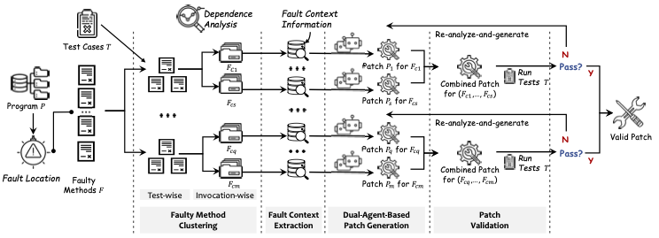

# PReMM: LLM-Based Program Repair for Multi-Method Bugs via Divide and Conquer

[toc]

## 1. Introduction

PReMM, an LLM-based program repair framework for Multi-Method Bugs.  PReMM builds on three core components:
the faulty method clustering component to partition the faulty methods into clusters based on the dependence relationship among them,
enabling a divide-and-conquer strategy for the repairing task;
the fault context extraction component to gather extra information about the fault context which can be utilized to better guide the diagnosis of the fault and the generation of correct patches;
the dual-agent-based patch generation component that employs two LLM-based agents with different roles to analyze the fault more precisely and generate patches of higher-quality.



Fig.1 Overview of PReMM

The purpose of this artifact is to support the claims made in our paper titled "PReMM: LLM-Based Program Repair for Multi-Method Bugs via Divide and Conquer". The artifact provides an implementation of `PReMM`, enabling reproducibility and facilitating further research and development based on our work.

```
PReMM
├── Config
│   ├── defects4j_environment.json
│   ├── llm_config.json
│   └── prompt.py
├── Overview.pdf
├── README.md
├── baselines.zip
├── basic_framework
│   ├── agent_state.py
│   ├── all_enum.py
│   ├── main_edge.py
│   ├── main_graph.py
│   ├── main_nodes.py
│   ├── program_analysis.py
│   ├── prompt.py
│   ├── repair_edge.py
│   ├── repair_graph.py
│   └── repair_nodes.py
├── defects4j_tools
│   ├── fault_location
│   ├── defects4j.py
│   ├── fault_localization.py
│   └── validation.py
├── java_lib
│   └── context-extractor.jar
├── logger.py
├── prepare_project.py
├── pyproject.toml
├── run.py
└── utils.py
```

### Overview of the Artifact

The Artifact implementation consists of two integrated components:

- **Python Repair Framework**: The primary repair pipeline
- **Java Program Analysis Module**: Handles static analysis tasks (packaged in `java-lib/context-extractor.jar`)

#### Key Integration Points

The Java analysis module is invoked by Python through two interfaces in `basic_framework/program_analysis.py`:

1. `program_analysis()`: Performs core dependency analysis
   - Inputs:
     - `root_dir`: Repository root (e.g., `/tmp/Chart-1`)
     - `source_dir`: Source code directory (e.g., `source`)
     - `class_dir`: Compiled classes path (e.g., `build/classes`)
     - `fault_loc_file`: File containing fault locations (e.g., `defects4j_tools/fault_location/defects4j/chart/1`)
     - `test_build_dir`: Test classes path (e.g., `build/test`)
     - `test_names`: List of failing tests (e.g., `["com.google.javascript.jscomp.ClosureReverseAbstractInterpreterTest::testGoogIsArray2"]`)
   - Outputs:
     - `signature_method_map`: Faulty method signatures mapped to metadata (line ranges) and `similar_codes` (possibly empty if no similar implementations exist).
     - `methods_tests_map`: Invocation-wise groupings of faulty methods to their covering test cases
     - `method_test_path_map`: Invocation chains from tests to faulty methods (per method signature)
2. `key_token_mining()`: Extracts critical tokens for repair
   - Inputs:
     - `root_dir`: Repository root (e.g., `/tmp/Chart-1`)
     - `file_path`: Target analysis file path
   - Output
     - `key_tokens`: key tokens mined in the current file.

#### Analysis Module Functionality

The Java component (`context-extractor.jar`) handles:

- Faulty Method Clustering:
  - Call graph construction
  - Dependency analysis for faulty methods/tests
- Fault Context Extraction:
  - Test-to-method invocation chain extraction
  - Project-wide similar code search
  - Key token mining

#### Python Repair Framework

- Core Responsibilities:
  - Orchestrating the overall repair pipeline
  - Patch generation using a dual-agent approach
  - Integration with external tools and modules
- Key Files
  - `main_graph.py`, `main_nodes.py`, `main_edge`: Implements the primary workflow (Fig. 1 pipeline)
  - `repair_graph.py`, `repair_nodes.py`,`repir_edge.py`: Dual-Agent patch generation for each invocation-wise faulty method group

### Supported Claims from the Paper

| Claim                       | Paper Section | Status    | Supporting Artifact          | Artifact Location                                | Notes                                                                                                |
| --------------------------- | ------------- | --------- | ---------------------------- | ------------------------------------------------ | ---------------------------------------------------------------------------------------------------- |
| Faulty Method Clustering    | 3.1           | Supported | DependencyAnalysis.java      | java_lib/context-extractor.jar                   | Implements repository call graph construction, test-wise clustering, and invocation-wise clustering. |
| Invocation Chain Extraction | 3.2           | Supported | DependencyAnalysis.java      | java_lib/context-extractor.jar                   | Extracts test-to-method invocation chains stored in method_test_path_map                             |
| Similar Code Search         | 3.2           | Supported | Searcher.java                | java_lib/context-extractor.jar                   | Finds project-wide similar implementations for faulty methods                                        |
| Key Token Mining            | 3.2           | Supported |                              | java_lib/context-extractor.jar                   | Implements signaturesMining in ProgramAnalysis.java                                                  |
| Dual-Agent Patch Generation | 3.3           | Supported | Repair Orchestration Modules | repair_graph.py, repair_nodes.py, repair_edge.py | Implements cooperative agent framework for patch generation per invocation-wise group                |

## 2. Hardware Dependencies

To fully evaluate the artifact, the following hardware is required:

- **Processor**: Minimum Intel i5 or equivalent (for basic evaluation), recommended: Intel i7 or better
- **RAM**: At least 8 GB (16 GB recommended)
- **GPU**: No need
- **Disk Space**: At least 10 GB of free space
- **Operating System**: Linux (Ubuntu 20.04+ preferred), macOS (10.14+)

## 3. Getting Started Guide

This guide will help you set up the environment and run a basic test case. Estimated time: 30 minutes.

### Prerequisites

- JDK 1.7 and JDK 1.8
- Python 3.10
- Conda (Miniconda or Anaconda)
- Internet access for downloading dependencies and LLM APIs

### Steps

#### Setup Java Environment

- The Java component (`context-extractor.jar`) requires JDK 8 to run.
- Install JDK 8 (if regenerating analysis data)

  Download from: https://www.oracle.com/java/technologies/javase/javase8u211-later-archive-downloads.html
- JDK 8 Environment

  - Set the environment variable `JAVA_HOME` to the path of the JDK 8 installation directory.

#### Set Up Conda Environment

```shell
conda create -n premm_env python=3.10
conda activate premm_env
```

#### Install Poetry

We provide a `poetry` configuration file (`pyproject.toml`) for PReMM to install dependencies.

```shell
pip install poetry
```

1. Configure Poetry to use the current Python environment:

```shell
poetry env use python3
```

2. Install project dependencies:

```shell
poetry install --no-root
```

### Dataset Preparation

#### Defects4J v1.4

- Install Defects4Jv1.4.0 (a more stable version of v1.2) from https://github.com/rjust/defects4j/tags
- JDK 1.7 for Defects4Jv1.4
  Install JDK1.7 from https://www.oracle.com/java/technologies/javase/javase7-archive-downloads.html
- Defects4Jv1.4 Initialization

```shell
cd defects4j-1.4.0
./init.sh
```

#### Defects4J v2.0

- Install Defects4Jv2.0.1 from https://github.com/rjust/defects4j/tags
- JDK 1.8 for Defects4Jv2.0
  Install JDK1.8 from https://www.oracle.com/java/technologies/javase/javase8u211-later-archive-downloads.html
- Defects4Jv2.0 Initialization

```shell
cd defects4j-2.0.1
./init.sh
```

## 4. Step-by-Step Instructions

This section details how to reproduce the core experiments described in the paper.

### Configuration

#### Datasets Configuration

Modify the `Config/defects4j_enviroment.json`

```python
{
  "JAVA_7_HOME": "<Your own path>", 
  "JAVA_8_HOME": "<Your own path>",
  "Defects4J_DIR": "<Your own path>", #.../defects4j-1.4.0
  "Defects4J_V2_DIR": "<Your own path>", #.../defects4j-2.0.1
  "TEMP_DIR": "/tmp" # working_dir
}
```

#### LLM Configuration

Since PReMM is an LLM-based tool, you can choose the following LLMs and enter your own api key. In our work, we use Qwen2.5-72B as our LLM.

```python
{
    "DeepSeek-V3": "<Your own key>",
    "Qwen2.5-32B":"<Your own key>",
    "Qwen2.5-72B":"<Your own key>",
    "CurrentLLM": "Qwen2.5-72B"

}
```

PReMM tool is invoked using the command line interface offered by `run.py`.

### The command line arguments

- `--dataset` , the current dataset you are target to repair, e.g., `defects4j` or `defects4jv2`.
- `--bug_id`, the target bug that you want to repair, e.g., `Chart-1`. If you want to repair all the bugs in the dataset, set it to `all`.
- `--chain_length` , the maximum iterative number, default is 5.
- `-f`, flag that enable faulty methods clustering.
- `-c`, flag that enable context extraction.
- `-d`, flag that enable dual-agent-based patch generation.

### Plausible patches generation

```shell
poetry run python run.py --dataset defects4j --bug_id Lang-7 -f -c -d --chain_length 5
```

### Output

After running PReMM, your output directory structure should be like the following:

```
output
└── Qwen2.5-72B-Local
    └── PReMM
        └── defects4j
            └── Lang
                ├── 7
                │   ├── Lang-7-5.java
                │   ├── patch-5.diff
                ├── Lang-7-5.log
                └── repair_result-5.csv

```

- If the final patch generated by PReMM pass all the test cases, we consider it as a plausible patch, and will store the patch in `bug/id/patch-{Chain_Length}.diff`,e.g., `Lang/7/patch-{Chain_Length}.diff`
- All the repair process of PReMM are stored in `Lang-7-{Chain_Length}.log`
- We also stores additional information in `repair_results-{Chain_Length}.scv`
  - **Bug_id**: The target bug id
  - **Repair_Result**: Indicates whether the patch was successfully repaired or not.
  - **Attempt Number**: Indicates how many attempts were made to generate a valid patch.
  - **Iteration Number**: Indicates how many iterations were needed to generate the valid patch (e.g., `1` means successful repair in first iteration of the Dul-LLM-agent).
  - **Last Attempt Token Usage**: Records both:
    - Total input tokens consumed by LLMs
    - Total output tokens produced by LLMs
  - **Token Usage**: Records both:
    - Total input tokens consumed by LLMs
    - Total output tokens produced by LLMs

#### Analysis Directory

The directory structure for the static analysis results is as follows:

```shell
analysis_output
└── defects4j
    └── Lang-7
        ├── method_test_path_map.pickle
        ├── methods_tests_map.pickle
        ├── signature_method_map.pickle
        └── test_cases_codes_map.pickle
```

- `method_test_path_map.pickle`: Invocation chains from tests to faulty methods (per method signature).
- `methods_tests_map.pickle`: Invocation-wise groupings of faulty methods to their covering test cases.
- `signature_method_map.pickle`: Faulty method signatures mapped to metadata (line ranges) and `similar_codes` (possibly empty if no similar implementations exist).
- `test_cases_codes_map.pickle`: This file contains a mapping between test cases and their codes.

#### Repair all the bugs in the dataset

Set the `bug_id` to `all`, `chain_length` to 5, and enable the flags `-f`, `-c`, and `-d` to enable faulty methods clustering, context extraction, and dual-agent-based patch generation. Then you can get the experiments results of PReMM in Section 4.5.1.

```shell
poetry run python run.py --dataset defects4j --bug_id all -f -c -d --chain_length 5
```

This will take a long time to finish. But you can stop the process at any time. We provide the output of the previous run in the `output` directory. So Next time you run the command, PReMM will continue from the last bug.

For quick evaluation, we recommend you to run single bug at a time.

```shell
poetry run python run.py --dataset defects4j --bug_id Lang-7 -f -c -d --chain_length 5
```

#### Ablation Study in Section 4.5.3

- PReMM-FCDI: When set `chain_length` to 1, disable the flags `-f`, `-c`, and `-d` to disable faulty methods clustering, context extraction, and dual-agent-based patch generation. We can get the results of PReMM-FCDI in Section 4.5.3.

```shell
poetry run python run.py --dataset defects4j --bug_id all --chain_length 1
```

- PReMM-FCD: When set `chain_length` to 5, disable the flags `-f`, `-c`, and `-d`. We can get the results of PReMM-FCD in Section 4.5.3.

```shell
poetry run python run.py --dataset defects4j --bug_id Lang-7 --chain_length 5
```

- PReMM-FC: When set `chain_length` to 5, disable the flags `-f`, `-c`, and enable `-d`. We can get the results of PReMM-FC in Section 4.5.3.

```shell
poetry run python run.py --dataset defects4j --bug_id all --chain_length 5 -d
```

- PReMM-FD: When set `chain_length` to 5, disable the flags `-f`, `-d`, and enable `-c`. We can get the results of PReMM-FD in Section 4.5.3.

```shell
poetry run python run.py --dataset defects4j --bug_id all --chain_length 5 -c
```

- PReMM-CD: When set `chain_length` to 5, disable the flags `-c`, `-d`, and enable `-f`. We can get the results of PReMM-CD in Section 4.5.3.

```shell
poetry run python run.py --dataset defects4j --bug_id all --chain_length 5 -f
```

- PReMM-F: When set `chain_length` to 5, disable the flags `-f`, and enable `-c`,`-d`. We can get the results of PReMM-F in Section 4.5.3.

```shell
poetry run python run.py --dataset defects4j --bug_id all --chain_length 5 -d -c
```

- PReMM-C: When set `chain_length` to 5, disable the flags `-c`, and enable `-f`,`-d`. We can get the results of PReMM-C in Section 4.5.3.

```shell
poetry run python run.py --dataset defects4j --bug_id all --chain_length 5 -d -f
```

- PReMM-D: When set `chain_length` to 5, disable the flags `-d`, and enable `-c`,`-f`. We can get the results of PReMM-D in Section 4.5.3.

```shell
poetry run python run.py --dataset defects4j --bug_id all --chain_length 5 -c -f
```

#### Result.zip

We provide the experiments results of PReMM-FCDI, PReMM-FCD, PReMM-FC, PReMM-FD, PReMM-CD, PReMM-F, PReMM-C, PReMM-D and PReMM in `Results.zip`

### Baseline Results in `baselines.zip`

The `baselines.zip` contains the results of the following baselines:

| Tool Name              | Repository                                  |
| ---------------------- | ------------------------------------------- |
| **RewardRepair** | https://github.com/ASSERT-KTH/RewardRepair/ |
| **TENURE**       | https://github.com/mxx1219/TENURE           |
| **KNOD**         | https://github.com/lin-tan/knod             |
| **Mulpo**        | https://zenodo.org/records/12660892         |
| **AlphaRepair**  | https://zenodo.org/records/6819444          |
| **GAMMA**        | https://github.com/iSEngLab/GAMMA           |
| **ChatRepair**   | https://figshare.com/s/9796028cef4d7dbc08ff |
| **ThinkRepair**  | https://github.com/vinci-grape/ThinkRepair  |

## 5 Reusability Guide

The artifact is designed to be reusable for research purposes. It includes all the necessary components to reproduce the experiments and analyze the results.

#### Static Analysis Module

The Java analysis module is invoked by Python through two interfaces in `basic_framework/program_analysis.py`:

1. `program_analysis()`: Performs core dependency analysis
   - Inputs:
     - `root_dir`: Repository root (e.g., `/tmp/Chart-1`)
     - `source_dir`: Source code directory (e.g., `source`)
     - `class_dir`: Compiled classes path (e.g., `build/classes`)
     - `fault_loc_file`: File containing fault locations (e.g., `defects4j_tools/fault_location/defects4j/groundtruth/chart/1`)
       - If you want to successfully reuse this artifact to new datasets, the fault location file should be in the same format as the one provided in the `defects4j_tools/fault_location/defects4j` directory.
       - ```shell
         org.jfree.chart.renderer.category.AbstractCategoryItemRenderer.getLegendItems:1797
         ```
     - `test_build_dir`: Test classes path (e.g., `build/test`)
     - `test_names`: List of failing tests (e.g., `["com.google.javascript.jscomp.ClosureReverseAbstractInterpreterTest::testGoogIsArray2"]`)
   - Outputs:
     - `signature_method_map`: Faulty method signatures mapped to metadata (line ranges) and `similar_codes` (possibly empty if no similar implementations exist).
     - `methods_tests_map`: Invocation-wise groupings of faulty methods to their covering test cases
     - `method_test_path_map`: Invocation chains from tests to faulty methods (per method signature)
2. `key_token_mining()`: Extracts critical tokens for repair
   - Inputs:
     - `root_dir`: Repository root (e.g., `/tmp/Chart-1`)
     - `file_path`: Target analysis file path (e.g., `source/org/apache/commons/math3/stat/inference/ChiSquareTest.java`)
   - Output
     - `key_tokens`: key tokens mined in the current file.

#### Python Repair Module

If you want to adapt the Python repair module to support new datasets, modifications may be required in the Patch Validation Module of the Python framework.

⚠️ Limitation Acknowledgment:

This artifact acknowledges its limitations due to differences in compilation and testing environments across various datasets. You may need to adjust build scripts, test runners, or validation logic depending on the structure of your new dataset.

## Planned Revisions for Artifact Evaluation

- **Current Paper Status**: Under Major Revision
- **Planned Enhancements**:
  We will incorporate an additional benchmark dataset (e.g., Defects4J-Trans) to further validate PReMM’s repair capabilities. This new dataset will help mitigate potential data contamination concerns while strengthening the generalizability of our results.
- Note: The primary evaluation dataset (Defects4J) remains unchanged. Experiments involving the new dataset will be presented in an expanded discussion section.
- **Impact on the Artifact**:
  The core technical implementation (e.g., repair algorithms) will remain unaffected. The artifact will be extended to include support for the new dataset without structural modifications.
